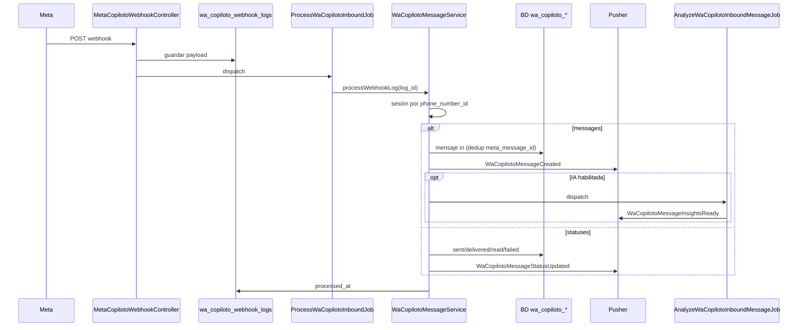

# Copiloto — flujo backend

Documentación del módulo de **ventas / Copiloto** en el backend Laravel.  
Revisado contra código: 2026-06-03.

---

## 1. Qué es “Copiloto” en este repo

Hay **tres cosas distintas** con nombre parecido:

| Módulo | Prefijo API | Integración | Uso actual |
|--------|-------------|-------------|------------|
| **WaCopiloto** | `/api/wa-copiloto/*` | Meta Cloud API | **Chat ventas en intranet** (activo) |
| **Copiloto legacy** | `/api/copiloto/*` | Bitrix + Evolution | Leads, fichas, histórico |
| **WhatsappInbox** | `/api/whatsapp-inbox/*` | Meta Cloud API | Coordinación (módulo aparte) |

El front de ventas usa **WaCopiloto**. El resto de este doc se centra ahí.

---

## 2. Vista rápida del flujo

```
                    ENTRANTE (cliente escribe)
Meta webhook ──► wa_copiloto_webhook_logs
              ──► ProcessWaCopilotoInboundJob (cola)
              ──► WaCopilotoMessageService
              ──► wa_copiloto_messages + conversación
              ──► Pusher (whatsapp-copiloto.ventas)
              ──► AnalyzeWaCopilotoInboundMessageJob (IA, opcional)

                    SALIENTE (agente responde)
Front JWT ──► WaCopilotoController
           ──► createOutboundPending (status=pending)
           ──► SendWaCopilotoOutboundJob (cola)
           ──► WaCopilotoSendService ──► Meta Graph API
           ──► actualiza meta_message_id + delivery_status
           ──► Pusher
```

---

## 3. Rutas y puntos de entrada

### 3.1 Webhooks (sin JWT)

| Ruta | Archivo | Función |
|------|---------|---------|
| `GET/POST /api/webhooks/meta/whatsapp-copiloto` | `MetaCopilotoWebhookController` | Webhook **dedicado** Copiloto |
| `GET/POST /api/webhooks/meta/whatsapp-inbox` | `MetaInboxWebhookController` + `MetaWhatsappWebhookRouter` | Puede enrutar también a Copiloto |
| `POST /api/evolution/webhook` | `EvolutionWebhookController` | Legacy; **off** por defecto |

**Webhook Copiloto (`receive`):**

1. Valida firma `X-Hub-Signature-256` (`META_WHATSAPP_COPILOTO_APP_SECRET` o el de inbox).
2. Guarda payload en `wa_copiloto_webhook_logs`.
3. Encola `ProcessWaCopilotoInboundJob`.
4. Responde `200` de inmediato.

### 3.2 API REST (JWT + rol Copiloto)

Archivo: `routes/modules/wa-copiloto.php`  
Middleware: `jwt.auth` + `role.copiloto_wa` (`EnsureCopilotoWaAccess`).

**Roles permitidos:** Cotizador, Administración, Gerencia, o usuario ID `28791` (Jefe Ventas).

| Método | Ruta | Descripción |
|--------|------|-------------|
| GET | `/wa-copiloto/session` | Sesión activa (slug default `ventas`) |
| GET | `/wa-copiloto/sessions` | Lista sesiones |
| POST | `/wa-copiloto/contacts/sync` | Importar contactos desde inbox |
| POST | `/wa-copiloto/contacts/{id}/open` | Abrir chat desde contacto |
| GET | `/wa-copiloto/conversations` | Bandeja de conversaciones |
| POST | `/wa-copiloto/conversations` | Crear conversación |
| GET | `/wa-copiloto/conversations/{id}/messages` | Historial (+ insights IA) |
| POST | `/wa-copiloto/conversations/{id}/messages` | Enviar texto/media (ventana 24h) |
| POST | `/wa-copiloto/conversations/{id}/templates` | Enviar plantilla Meta |
| PATCH | `/wa-copiloto/conversations/{id}/assign` | Asignar agente |
| PATCH | `/wa-copiloto/conversations/{id}/contact-name` | Renombrar contacto |
| PATCH | `/wa-copiloto/conversations/{id}/read` | Marcar leído |
| GET/POST | `/wa-copiloto/conversations/{id}/suggestion-usages` | Tracking sugerencias IA |
| GET | `/wa-copiloto/templates` | Plantillas Meta filtradas |
| GET | `/wa-copiloto/users/assignable` | Usuarios para asignar |

### 3.3 Copiloto legacy (`/api/copiloto/*`)

Solo `jwt.auth`. Consulta tablas Bitrix/Evolution.

| Ruta | Estado |
|------|--------|
| `GET /leads` | OK |
| `GET /conversacion/{phone}` | OK |
| `GET /ficha/{phone}` | OK |
| `POST /responder` | **501** — no implementado |
| `GET /sync/estado` | Estado cache Evolution/Bitrix |

### 3.4 Comandos Artisan

| Comando | Qué hace |
|---------|----------|
| `copiloto:health-check` | Ping Evolution + Bitrix → cache |
| `copiloto:export-csv` | Exporta chats WON Bitrix → `storage/app/conversaciones_WON.csv` |
| `copiloto:sync-historico` | Sync histórico (debug/scripts) |

---

## 4. Flujo entrante (detalle)



**`WaCopilotoMessageService::processWebhookLog`**

- Resuelve sesión: `wa_copiloto_sessions.phone_number_id`.
- Crea o actualiza conversación por `phone_e164`.
- Tipos: `text`, `button`, `interactive`, `image`, `video`, `document`, `audio`, `sticker`.
- Media entrante: `WaCopilotoInboundMediaService` → descarga Graph API → S3.
- Actualiza cabecera conversación: `unread_count`, `window_expires_at`, `last_message_preview`, etc.
- Deduplica por `meta_message_id` (índice único).

**Router compartido** (`MetaWhatsappWebhookRouter`):

- Si `phone_number_id` matchea **solo** copiloto → Copiloto.
- Si matchea inbox (aunque también copiloto) → **Inbox tiene prioridad**.
- Con webhook dedicado `/whatsapp-copiloto` no dependes del router.

---

## 5. Flujo saliente (detalle)

### 5.1 Texto o media (`sendMessage`)

1. `WaCopilotoWindowService::computeWindowState` — si ventana cerrada → **422** (“Envía plantilla para reactivar”).
2. `createOutboundPending` → fila en `wa_copiloto_messages` con `delivery_status=pending`.
3. `SendWaCopilotoOutboundJob::dispatch`.
4. Job llama `WaCopilotoSendService::sendOutboundMessage` → Graph API.
5. Actualiza `meta_message_id`, `delivery_status=sent`, broadcast Pusher.

Soporta: texto, imagen, video, documento, audio (subida vía `WaCopilotoMediaUploadService`).

### 5.2 Plantilla (`sendTemplate`)

1. Valida nombre: `WaCopilotoTemplateService::assertTemplateAllowed`.
2. Si plantilla lleva header IMAGE/VIDEO/DOCUMENT → sube archivo a S3 (`CoordinacionMediaLink`).
3. Dos caminos:
   - **Sync** (header media pesado): envío directo sin job.
   - **Async**: `createOutboundPending` + `SendWaCopilotoOutboundJob`.
4. Video: transcodificación opcional (`WaInboxVideoTranscoder` + ffmpeg).

### 5.3 Ventana de servicio 24h

| Tipo | Ventana cerrada |
|------|-----------------|
| Texto / media libre | Bloqueado |
| Plantilla Meta | Permitido (reactiva ventana) |

La ventana se calcula desde `last_customer_message_at` / `window_expires_at` en la conversación.

---

## 6. Plantillas Meta

**Config:** `config/meta_whatsapp_copiloto.php`  
**Servicio:** `WaCopilotoTemplateService`

### Listado (`GET /templates`)

1. Cache **1 hora** → clave `wa_copiloto_meta_templates_v3_{hash}`.
2. Graph API: `GET /{waba_id}/message_templates`.
3. Si falla → plantillas fallback hardcode (`pb_ventas_bienvenida_v1`, etc.).

### Filtros

| Tipo | Prefijos default |
|------|------------------|
| Incluir (ventas) | `pb_ventas_`, `pb_copiloto_`, `copiloto_` |
| Excluir (coordinación) | `pb_proveedor_`, `pb_inspeccion_`, `pb_rotulado_`, `pb_docs_`, `pb_entrega_` |

Además: `wa_copiloto_sessions.template_name_prefix` puede acotar por sesión.

### Envío

- Body params en JSON (`params` en request).
- Header en `params._header` o upload `header_media`.
- Preview chat: sustituye `{{var}}` en plantilla (`preview_from_template`).
- Parámetro vacío → `—` (`empty_body_parameter_placeholder`).

---

## 7. IA (Gemini)

Solo mensajes **entrantes del cliente**.

| Pieza | Archivo / tabla |
|-------|-----------------|
| Job | `AnalyzeWaCopilotoInboundMessageJob` |
| Servicio | `WaCopilotoMessageAnalysisService` |
| Contexto chat | `WaCopilotoConversationContextService` |
| Resultados | `wa_copiloto_message_insights` |
| Score/resumen | `wa_copiloto_conversations` (`ai_temperatura`, `ai_lead_score`, `ai_context_summary`) |
| Uso sugerencias | `wa_copiloto_suggestion_usages` |

**Condiciones:**

- `META_WHATSAPP_COPILOTO_ANALYSIS_ENABLED=true`
- Teléfono en `META_WHATSAPP_COPILOTO_ANALYSIS_ALLOWED_PHONES` (`51912705923`, CSV, o `*`)

Evento Pusher: `WaCopilotoMessageInsightsReady`.

Fallback temperatura: `copiloto_fichas` (legacy) si `ai_temperatura` es null.

---

## 8. Tiempo real (Pusher)

Canal: `whatsapp-copiloto.{slug}` (default `whatsapp-copiloto.ventas`).  
Autorización: `routes/channels.php`.

| Evento | Cuándo |
|--------|--------|
| `WaCopilotoMessageCreated` | Mensaje nuevo in/out |
| `WaCopilotoMessageStatusUpdated` | Cambio delivery |
| `WaCopilotoMessageInsightsReady` | IA terminó |

Desactivar: `META_WHATSAPP_COPILOTO_BROADCAST=false`.

---

## 9. Base de datos

### WaCopiloto (activo)

| Tabla | Contenido |
|-------|-----------|
| `wa_copiloto_sessions` | Línea Meta: `slug`, `phone_number_id`, `waba_id`, prefijo plantillas |
| `wa_copiloto_conversations` | Chat por teléfono, asignación, ventana, campos IA |
| `wa_copiloto_messages` | Mensajes, plantillas, media, `meta_message_id`, delivery |
| `wa_copiloto_webhook_logs` | Payload crudo webhook |
| `wa_copiloto_message_insights` | IA por mensaje |
| `wa_copiloto_suggestion_usages` | Sugerencias usadas por agente |

Migración base: `database/migrations/2026_06_04_100000_create_wa_copiloto_tables.php`.

### Legacy

| Tabla | Contenido |
|-------|-----------|
| `copiloto_conversaciones` | Hilos Bitrix/Evolution |
| `whatsapp_messages` | Mensajes históricos |
| `copiloto_fichas` | Ficha lead (temperatura, nivel) |

### Compartido con Inbox

| Tabla | Uso |
|-------|-----|
| `wa_contacts` | Directorio; `WaContactService::syncFromInbox()` trae teléfonos de `wa_inbox_conversations` |

---

## 10. Jobs y colas

| Job | Cola env | Trigger |
|-----|----------|---------|
| `ProcessWaCopilotoInboundJob` | `META_WHATSAPP_COPILOTO_QUEUE` | Webhook |
| `SendWaCopilotoOutboundJob` | misma | Envío async |
| `AnalyzeWaCopilotoInboundMessageJob` | `META_WHATSAPP_COPILOTO_ANALYSIS_QUEUE` | Mensaje in + IA on |

Default cola: `notificaciones`.

**Multi-tenant:** jobs usan `DatabaseConnectionTrait` + `WaCopilotoJobContext` (`META_WHATSAPP_COPILOTO_JOB_DOMAIN`).

**Batch outbound:** `WaCopilotoOutboundBatchService` existe para encadenar envíos post-coordinación, pero **no está cableado** hoy (solo inbox batch).

---

## 11. Mapa de archivos

```
app/Http/Controllers/WaCopiloto/
  MetaCopilotoWebhookController.php
  WaCopilotoController.php

app/Http/Controllers/Copiloto/
  CopilotoController.php                    # legacy

app/Services/WaCopiloto/
  WaCopilotoSessionService.php
  WaCopilotoConversationService.php
  WaCopilotoMessageService.php              # núcleo in/out
  WaCopilotoSendService.php                 # Graph API
  WaCopilotoTemplateService.php
  WaCopilotoWindowService.php
  WaCopilotoInboundMediaService.php
  WaCopilotoMediaUploadService.php
  WaCopilotoMessageAnalysisService.php
  WaCopilotoConversationContextService.php
  WaCopilotoSuggestionUsageService.php

app/Jobs/WaCopiloto/
  ProcessWaCopilotoInboundJob.php
  SendWaCopilotoOutboundJob.php
  AnalyzeWaCopilotoInboundMessageJob.php

app/Support/WhatsApp/
  MetaWhatsappWebhookRouter.php
  WaCopilotoJobContext.php
  CoordinacionMediaLink.php                 # URLs S3 para media plantillas

config/meta_whatsapp_copiloto.php
routes/modules/wa-copiloto.php
routes/modules/copiloto.php
```

---

## 12. Variables de entorno

### WaCopiloto (principal)

```env
META_WHATSAPP_COPILOTO_ENABLED=false
META_WHATSAPP_COPILOTO_PHONE_NUMBER_ID=
META_WHATSAPP_COPILOTO_WABA_ID=
META_WHATSAPP_ACCESS_TOKEN=                 # compartido con inbox
META_WHATSAPP_COPILOTO_WEBHOOK_VERIFY_TOKEN=
META_WHATSAPP_COPILOTO_APP_SECRET=
META_WHATSAPP_COPILOTO_SESSION_SLUG=ventas
META_WHATSAPP_COPILOTO_QUEUE=notificaciones
META_WHATSAPP_COPILOTO_BROADCAST=true
META_WHATSAPP_COPILOTO_JOB_DOMAIN=

# Plantillas
META_WHATSAPP_COPILOTO_TEMPLATE_PREFIXES=pb_ventas_,pb_copiloto_,copiloto_
META_WHATSAPP_COPILOTO_TEMPLATE_EXCLUDE_PREFIXES=pb_proveedor_,pb_inspeccion_,...

# IA
META_WHATSAPP_COPILOTO_ANALYSIS_ENABLED=true
META_WHATSAPP_COPILOTO_ANALYSIS_ALLOWED_PHONES=51912705923
META_WHATSAPP_COPILOTO_ANALYSIS_QUEUE=
```

Lista completa: `config/meta_whatsapp_copiloto.php`.

### Legacy

```env
COPILOTO_EVOLUTION_WEBHOOK_ENABLED=false
EVOLUTION_URL=
EVOLUTION_INSTANCE=
EVOLUTION_API_KEY=
BITRIX_WEBHOOK_URL=
```

---

## 13. Copiloto vs WhatsappInbox

| | Inbox | Copiloto |
|---|-------|----------|
| Propósito | Coordinación operativa | Ventas |
| API | `/whatsapp-inbox/*` | `/wa-copiloto/*` |
| Rol | `role.coordinacion` | `role.copiloto_wa` |
| Tablas | `wa_inbox_*` | `wa_copiloto_*` |
| Pusher | `whatsapp-inbox.coordinacion` | `whatsapp-copiloto.ventas` |
| Plantillas | Operativas | Ventas (excluye coord.) |
| IA | No | Gemini |

**Enlaces entre módulos:**

- Contactos: inbox → `wa_contacts` → copiloto (`syncFromInbox`).
- Webhook: router puede mandar al módulo según `phone_number_id`.
- Infra: S3, token Meta, transcodificador video.

---

## 14. Deuda técnica / pendientes

| Tema | Estado |
|------|--------|
| `POST /copiloto/responder` | 501 |
| Webhook Evolution | Deshabilitado por defecto |
| `WaCopilotoOutboundBatchService` | Sin cablear a batch coordinación |
| Dos BDs conceptuales | WaCopiloto Meta + legacy Bitrix en paralelo |
| Misma WABA en inbox y copiloto | Router prioriza inbox |

---

## 15. Guía rápida “¿dónde miro?”

| Necesito… | Archivo |
|-----------|---------|
| Recibir webhook Meta | `MetaCopilotoWebhookController` |
| Procesar mensaje entrante | `WaCopilotoMessageService::processWebhookLog` |
| Enviar a Meta | `WaCopilotoSendService` |
| API del chat | `WaCopilotoController` |
| Plantillas | `WaCopilotoTemplateService` |
| Config | `config/meta_whatsapp_copiloto.php` |
| Rutas ventas | `routes/modules/wa-copiloto.php` |
| Legacy Bitrix | `CopilotoController` |
